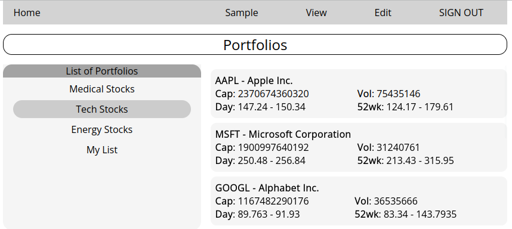

# Stock Portfolio

https://www.udemy.com/course/complete-react-developer-zero-to-mastery/

After finishing this Udemy course on React development, I created a simple React Application as practice.



## Live Demo

https://jovial-cuchufli-ae6b4f.netlify.app/

## Features

- A reusable ItemList component that displays portfolio names and stock symbol lists
- A context that holds a directory of stock portfolios
- User authentication through Firebase and CRUD operations against a Firestore database
- Visitors can view a sample portfolio with live data
- Logged in users can create and view their own portfolios that are stored on Firebase
- Stock data is loaded through the browser from Yahoo Finance, using allorigins.win to get around CORS issues
- Responsive design for mobile devices

## Firebase rules for database

```
rules_version = '2';
service cloud.firestore {
  match /databases/{database}/documents {
    match /users/{userId}/{document=**} {
      allow read,write: if request.auth != null && request.auth.uid == userId;
    }
    match /portfolios/{userId}/{document=**} {
      allow read,write: if request.auth != null && request.auth.uid == userId;
    }
  }
}
```
